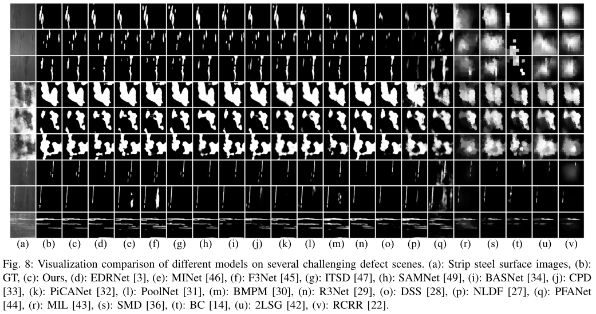

# DACNet
'[Dense Attention-guided Cascaded Network for Salient Object Detection of Strip Steel Surface Defects](https://ieeexplore.ieee.org/stamp/stamp.jsp?tp=&arnumber=9632537)', [Xiaofei Zhou](https://scholar.google.com.hk/citations?hl=zh-CN&user=2PUAFW8AAAAJ), Hao Fang, Zhi Liu, Bolun Zheng, Yaoqi Sun, Jiyong Zhang, and Chenggang Yan.

## Usage
1. Clone this repo
```
git@github.com:zxforchid/DACNet.git
```

## Architecture


## Quantitative Comparison


## Qualitative Comparison


## Citation
```
@article{zhou2021dense,
  title={Dense Attention-guided Cascaded Network for Salient Object Detection of Strip Steel Surface Defects},
  author={Zhou, Xiaofei and Fang, Hao and Liu, Zhi and Zheng, Bolun and Sun, Yaoqi and Zhang, Jiyong and Yan, Chenggang},
  journal={IEEE Transactions on Instrumentation and Measurement},
  year={2021},
  publisher={IEEE}
}
```
